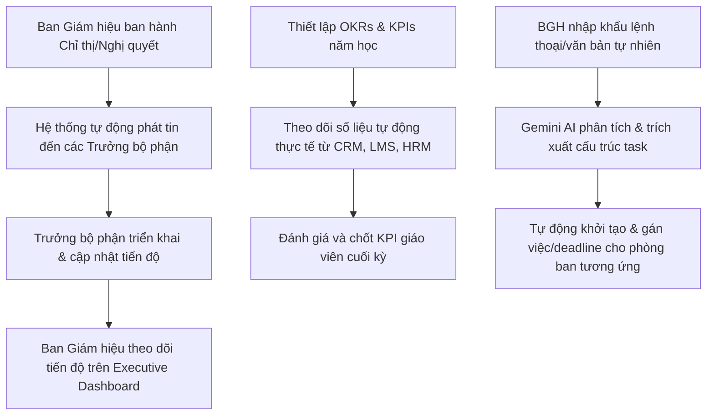
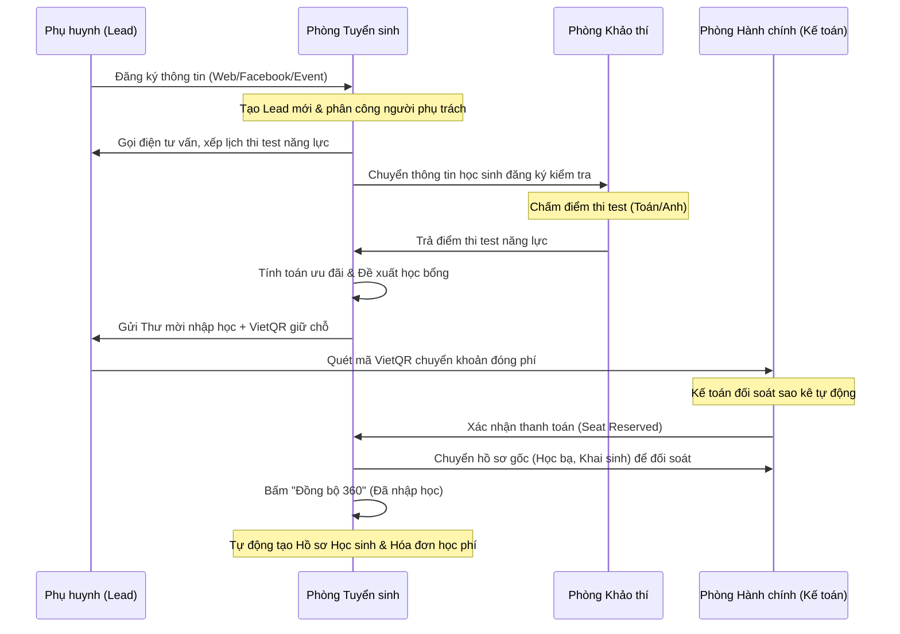
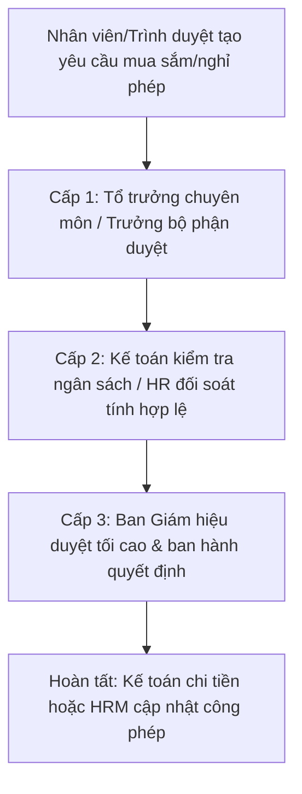
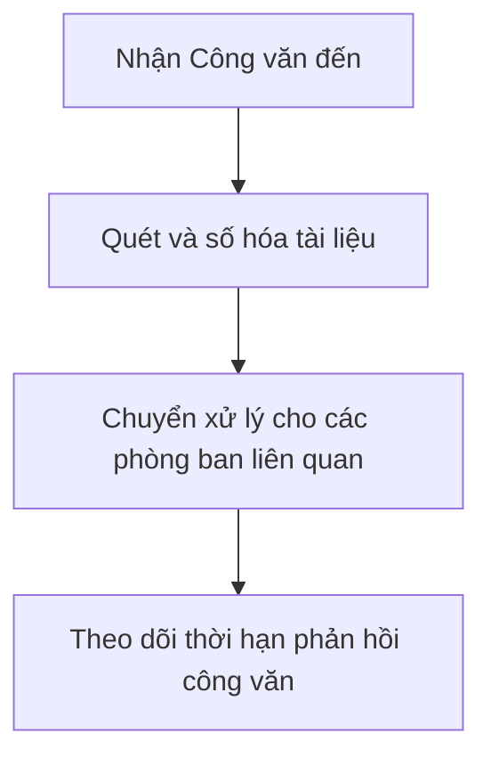
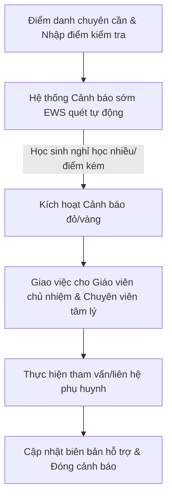
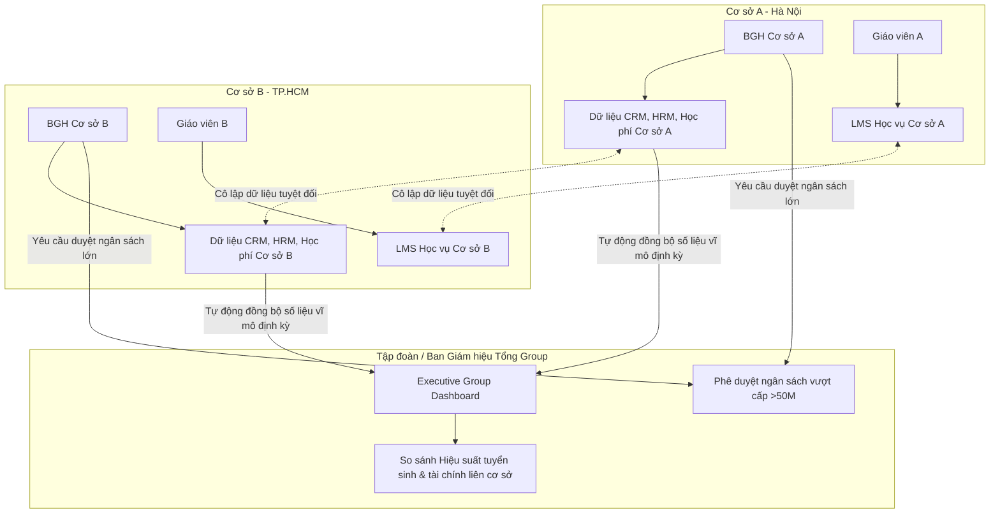

# Phân Tích Chi Tiết Luồng Hoạt Động & Quy Trình Công Việc Các Phòng Ban (MIS Smart Portal)

Hệ thống MIS Smart Portal là một giải pháp quản trị trường học liên thông (School ERP/Portal) toàn diện, kết nối luồng thông tin và nghiệp vụ của tất cả các bộ phận từ Ban Giám hiệu đến các phòng ban vận hành và Tổ chuyên môn.

---

## 1. Ban Giám hiệu & Hội đồng Trường (BGH)

### Vai trò & Nhiệm vụ cốt lõi:
* Chỉ đạo điều hành vĩ mô, ban hành chính sách và nghị quyết chiến lược.
* Giám sát mục tiêu toàn trường (OKRs) và đánh giá hiệu suất nhân sự (KPIs).
* Phê duyệt các quy trình tài chính, đề xuất hành chính quan trọng.
* Kiểm soát các cảnh báo rủi ro vận hành học đường.
* Sử dụng Trợ lý ảo AI Co-Pilot & Lệnh giọng nói (Voice-to-task) để phân tích báo cáo minh chứng và tự động cấu trúc hóa, giao việc trực tiếp xuống các khối/phòng ban.

### Quy trình công việc hiện tại (Luồng hoạt động):

* **Công cụ tích hợp**: [ExecutiveDashboard.tsx](file:///Users/nghialeluong/Desktop/mis%20cms/src/components/ExecutiveDashboard.tsx), [BoardDirectivePanel.tsx](file:///Users/nghialeluong/Desktop/mis%20cms/src/components/BoardDirectivePanel.tsx), [StrategyOkrHub.tsx](file:///Users/nghialeluong/Desktop/mis%20cms/src/components/StrategyOkrHub.tsx).

---

## 2. Phòng Tuyển sinh & Truyền thông (Admissions & PR)

### Vai trò & Nhiệm vụ cốt lõi:
* Thu hút thông tin (Lead Intake) từ các chiến dịch truyền thông (Facebook, Website, Event, Referral).
* Tư vấn chương trình học, theo dõi và nuôi dưỡng phụ huynh qua các giai đoạn.
* Tổ chức kiểm tra năng lực đầu vào và đề xuất học bổng.
* Thu phí giữ chỗ/nhập học và bàn giao học sinh mới cho bộ phận học vụ.

### Quy trình công việc hiện tại (Luồng hoạt động):

* **Công cụ tích hợp**: [SchoolCrmHub.tsx](file:///Users/nghialeluong/Desktop/mis%20cms/src/components/SchoolCrmHub.tsx), [EventManagement.tsx](file:///Users/nghialeluong/Desktop/mis%20cms/src/components/EventManagement.tsx).

---

## 3. Tổ Văn phòng & Kế toán - Tài chính (Administration & Finance)

### Vai trò & Nhiệm vụ cốt lõi:
* Quản lý công văn đi, công văn đến và kho lưu trữ văn bản số.
* Lên lịch họp, đặt phòng họp và quản lý biên bản họp (Meeting Minutes).
* Quản lý thu - chi học phí, đối soát giao dịch ngân hàng tự động.
* Phê duyệt các quy trình yêu cầu hành chính (Nghỉ phép, mua sắm thiết bị, tạm ứng).

### Quy trình công việc hiện tại (Luồng hoạt động):
* **Quy trình Phê duyệt 3 Cấp (3-Level Approval Flow)**:

* **Quy trình Quản lý Công văn & Tài liệu**:

* **Công cụ tích hợp**: [DocumentCenter.tsx](file:///Users/nghialeluong/Desktop/mis%20cms/src/components/DocumentCenter.tsx), [MeetingCenter.tsx](file:///Users/nghialeluong/Desktop/mis%20cms/src/components/MeetingCenter.tsx), [SchoolRequests.tsx](file:///Users/nghialeluong/Desktop/mis%20cms/src/components/SchoolRequests.tsx), [WorkflowBuilder.tsx](file:///Users/nghialeluong/Desktop/mis%20cms/src/components/WorkflowBuilder.tsx).

---

## 4. Trung Tâm Nhân Sự HRM (Human Resources)

### Vai trò & Nhiệm vụ cốt lõi:
* Quản lý hồ sơ giáo viên, nhân viên và lịch sử hợp đồng lao động.
* Theo dõi bảng chấm công hàng ngày, quản lý ngày phép.
* Tính lương tự động dựa trên mức lương cơ bản, KPI đạt được, phụ cấp và các khoản giảm trừ.
* Quản lý lộ trình đào tạo và phát triển chuyên môn của giáo viên (CPD Logs).

### Quy trình công việc hiện tại (Luồng hoạt động):
* **Tuyển dụng & Onboarding**: Nhân sự mới điền thông tin -> Đăng ký không gian làm việc chuyên môn -> Cập nhật MI Profile (Trí tuệ đa dạng) để bố trí công việc phù hợp.
* **Chấm công & Tính lương**: Hằng ngày ghi nhận vân tay/chấm công số -> Cuối tháng Kế toán/HRM kiểm tra ngày công, đi trễ, nghỉ phép -> Áp chỉ số KPI -> Hệ thống tính bảng lương tự động -> Xuất phiếu lương (Payslip) gửi giáo viên.
* **Đánh giá năng lực**: Giáo viên tự khai báo số giờ tự học/tham gia tập huấn (CPD Hours) -> Tổ trưởng duyệt chứng chỉ -> Cộng vào điểm đánh giá xếp loại cuối năm.

* **Công cụ tích hợp**: [HrmCenter.tsx](file:///Users/nghialeluong/Desktop/mis%20cms/src/components/HrmCenter.tsx).

---

## 5. Tổ Công tác Học sinh & Tham vấn (Student Success & Counseling)

### Vai trò & Nhiệm vụ cốt lõi:
* Quản lý kỷ luật tích cực, nề nếp bán trú của học sinh toàn trường.
* Tổ chức các hoạt động ngoại khóa, câu lạc bộ (CLB) và sự kiện học sinh.
* Hỗ trợ tâm lý học đường, tư vấn học đường và tham vấn hướng nghiệp.
* Quản lý **Hệ thống cảnh báo sớm (Early Warning System - EWS)** để phát hiện học sinh sa sút.

### Quy trình công việc hiện tại (Luồng hoạt động):

* **Công cụ tích hợp**: [StudentSuccessHub.tsx](file:///Users/nghialeluong/Desktop/mis%20cms/src/components/StudentSuccessHub.tsx).

---

## 6. Tổ Chuyên Môn & Giảng Dạy (Academic Departments)

### Vai trò & Nhiệm vụ cốt lõi:
* Biên soạn giáo án, chương trình giảng dạy theo chuẩn GDPT 2018.
* Giảng dạy, quản lý lớp học trực tuyến và giao bài tập trên hệ thống LMS.
* Ghi nhận điểm số chuyên cần và điểm đánh giá thường xuyên của học sinh.

### Quy trình công việc hiện tại (Luồng hoạt động):
1. **Duyệt giáo án**: Giáo viên soạn bài giảng/giáo án số trên hệ thống -> Trình Tổ trưởng chuyên môn -> Tổ trưởng phê duyệt trực tuyến -> Giáo viên tiến hành lên lớp giảng dạy.
2. **Vận hành Lớp học số (LMS)**: Giáo viên tạo khóa học -> Đăng tài liệu giảng dạy -> Giao bài tập về nhà -> Học sinh làm bài tập -> Hệ thống tự động chấm điểm trắc nghiệm / Giáo viên chấm tự luận -> Điểm số tự động đẩy về sổ điểm học bạ điện tử.

* **Công cụ tích hợp**: [AcademicOperations.tsx](file:///Users/nghialeluong/Desktop/mis%20cms/src/components/AcademicOperations.tsx), [MisLmsCenter.tsx](file:///Users/nghialeluong/Desktop/mis%20cms/src/components/MisLmsCenter.tsx).

---

## 7. Phòng Dịch vụ & Vận hành Học đường (School Logistics)

### Vai trò & Nhiệm vụ cốt lõi:
* Quản lý vận hành xe đưa đón học sinh (Bus service) và bếp ăn bán trú.
* Quản lý thư viện trường học (đầu sách, mượn/trả sách, thẻ thư viện).
* Quản lý tài sản cố định, trang thiết bị phòng học, phòng thí nghiệm và lập lịch bảo dưỡng.

### Quy trình công việc hiện tại (Luồng hoạt động):
* **Mượn trả sách**: Học sinh quét thẻ thư viện -> Hệ thống kiểm tra hạn mức mượn -> Ghi nhận ngày mượn -> Gửi thông báo nhắc trả khi quá hạn.
* **Yêu cầu sửa chữa thiết bị**: Giáo viên báo hỏng điều hòa/máy chiếu -> Tạo yêu cầu bảo trì gửi Phòng Vận hành -> Phòng Vận hành cử kỹ thuật sửa chữa -> Nghiệm thu và cập nhật trạng thái thiết bị.

* **Công cụ tích hợp**: [SchoolLogistics.tsx](file:///Users/nghialeluong/Desktop/mis%20cms/src/components/SchoolLogistics.tsx).

---

## 8. Cổng Phụ huynh & Học sinh (Parent & Student Portal)

### Vai trò & Nhiệm vụ cốt lõi:
* Cung cấp kênh kết nối liên lạc trực tiếp giữa Nhà trường và Gia đình.
* Phụ huynh theo dõi học tập, chuyên cần, sức khỏe và thời khóa biểu của con.
* Nhận thông báo từ nhà trường, đóng học phí trực tuyến bằng quét mã VietQR.

### Quy trình công việc hiện tại (Luồng hoạt động):
1. Phụ huynh đăng nhập cổng thông tin bằng tài khoản liên kết SĐT.
2. Xem thông tin điểm kiểm tra và chuyên cần thực tế được giáo viên cập nhật hàng ngày.
3. Nhận phiếu báo phí hàng tháng -> Bấm thanh toán -> Quét mã VietQR (được sinh tự động đúng số tiền và cú pháp chuyển khoản) -> Tiền về tài khoản nhà trường và hệ thống Kế toán tự động gạch nợ.

---

## 9. Phân Hạng Tính Năng Theo Gói Dịch Vụ & Bảo Mật RBAC

Nhằm đáp ứng linh hoạt quy mô trường học, hệ thống **MIS Smart Portal (Trường học số)** được quy hoạch thành 3 phân hạng (gói dịch vụ) rõ rệt với cơ chế bảo mật phân quyền vai trò (RBAC) đồng bộ:

### 9.1. Ma Trận Phân Phối Tính Năng (Feature Matrix)

| Nhóm Phân Hệ | Tính Năng Chi Tiết | Gói Cơ Bản | Gói Nâng Cao | Gói Chuyên Nghiệp |
| :--- | :--- | :---: | :---: | :---: |
| **Tuyển Sinh & CRM** | Thu hút thông tin (Lead Intake), Tư vấn học sinh, Checklist hồ sơ | Cơ bản | Đầy đủ | Đầy đủ |
| **Học Học Vụ & LMS** | Quản lý thời khóa biểu, sổ điểm học bạ, Lớp học số LMS | Có | Có | Có |
| **Cổng Kết Nối** | Cổng thông tin phụ huynh & học sinh (Parent Portal) | Có | Có | Có |
| **Phê Duyệt Số** | Phê duyệt yêu cầu / quy trình 3 cấp tự động | Không | Có | Có |
| **Nhân Sự HRM** | Chấm công vân tay/face ID, tính lương giáo viên tự động | Không | Có | Có |
| **Tài Chính Học Đường**| Quản lý thu-chi học phí, hóa đơn, sinh VietQR động đối soát | Không | Có | Có |
| **Vận Hành Hậu Cần**| Quản lý tuyến xe bus đưa đón, suất ăn bán trú & Thư viện | Không | Có | Có |
| **Báo Cáo Điều Hành**| Báo cáo vĩ mô Ban Giám hiệu (Executive Dashboard) | Không | Không | Có |
| **Trợ Lý AI** | Trợ lý ảo AI Co-Pilot & Lệnh thoại Voice-to-task (Gemini API) | Không | Không | Có |
| **Phân Quyền RBAC** | Cấu hình ma trận phân quyền chi tiết theo vai trò | Không | Không | Có |
| **Liên Thông Dữ Liệu**| Tích hợp API đồng bộ hệ thống ngoài (EMIS, vnEdu...) | Không | Không | Có |

### 9.2. Phân Quyền Vai Trò (Role-Based Access Control - RBAC)

Tính năng bảo mật đa phân hệ được kiểm soát chặt chẽ thông qua phân quyền vai trò (RBAC):
1. **Ban Giám hiệu (BGH / ADMIN)**: 
   * Truy cập toàn bộ phân hệ quản trị.
   * Xem Dashboard phân tích vĩ mô, cảnh báo rủi ro toàn trường.
   * Phê duyệt quy trình cấp 3 (duyệt cuối cùng).
   * Sử dụng Trợ lý ảo AI & Lệnh giọng nói (Voice-to-task) để tạo chỉ đạo.
2. **Trưởng bộ phận / Tổ trưởng (MANAGER)**:
   * Quản lý không gian làm việc chuyên môn (ví dụ: Tổ Toán-Tin, Tổ Ngữ văn).
   * Phê duyệt yêu cầu cấp 1 và cấp 2 của giáo viên thuộc tổ.
   * Kiểm tra tiến độ và nghiệm thu báo cáo công tác trước khi trình lên BGH.
3. **Giáo viên / Nhân viên (TEACHER / STAFF)**:
   * Giảng dạy trên LMS, nhập điểm chuyên cần, điểm thường xuyên.
   * Nộp giáo án số để tổ trưởng duyệt chuyên môn.
   * Khởi tạo đề xuất hành chính (nghỉ phép, mua sắm...) trình phê duyệt đa cấp.
4. **Kế toán / Thủ quỹ (FINANCE)**:
   * Kiểm tra hóa đơn học phí, đối soát VietQR ngân hàng.
   * Chạy bảng chấm công và duyệt chi bảng lương HRM.
   * Thẩm định ngân sách các đề xuất mua sắm (Cấp 2).
5. **Nhân sự (HR)**:
   * Cập nhật thông tin nhân viên mới, hợp đồng lao động.
   * Cập nhật chỉ số phát triển chuyên môn (CPD Logs) và chỉ số đa trí tuệ (MI Profile).
6. **Vận hành & Hậu cần (LOGISTICS)**:
   * Điều phối lịch trình xe đưa đón học sinh (Bus service).
   * Điểm danh lên xuống xe của học sinh, quản lý suất ăn.
   * Thực hiện quy trình mượn/trả sách thư viện số.

---

## 10. Luồng Quản lý Đa Cơ sở & Phân Cấp Dữ Liệu (Multi-campus & Data Hierarchy)

Nhằm đáp ứng mô hình các chuỗi trường học liên cấp hoặc tập đoàn giáo dục, hệ thống hỗ trợ kiến trúc **Đa cơ sở (Multi-campus / Multi-tenancy)** để vừa đảm bảo tính cô lập an toàn dữ liệu, vừa tối ưu hóa công tác điều hành vĩ mô từ BGH Tổng (Tập đoàn).

### 10.1. Sơ đồ Phân cấp Dữ liệu & Quy trình Vận hành Đa Cơ sở

### 10.2. Chi Tiết Cơ Chế Phân Cấp và Cô Lập Dữ Liệu (Data Isolation Scoping)

Cơ chế phân quyền phạm vi truy cập dữ liệu (Data Scoping) được chia làm 3 tầng:

1. **Phạm vi Toàn hệ thống (Group Executive Scope)**:
   * **Đối tượng**: Ban Giám hiệu Tổng (Hội đồng Quản trị Tập đoàn), Quản trị viên hệ thống SaaS.
   * **Quyền hạn**:
     * Xem **Báo cáo so sánh chéo (Cross-campus Performance Analytics)** về tuyển sinh, tài chính, nhân sự toàn hệ thống.
     * Cấu hình các quy chế, chính sách nhân sự, định mức học phí khung áp dụng chung cho tất cả các cơ sở.
     * Tiếp nhận và phê duyệt các đề nghị ngân sách vượt hạn mức phân quyền của giám đốc cơ sở (Duyệt cấp 4).
2. **Phạm vi Cơ sở (Campus Tenant Scope)**:
   * **Đối tượng**: Ban Giám hiệu Cơ sở (Hiệu trưởng / Giám đốc điều hành cơ sở), Kế toán trưởng cơ sở, HRM cơ sở.
   * **Quyền hạn**:
     * Vận hành, điều phối toàn bộ nguồn lực thuộc cơ sở trực thuộc (tuyển sinh cơ sở, học phí cơ sở, bảng lương nhân sự cơ sở).
     * **Bảo mật**: Không được phép truy cập, chỉnh sửa hoặc xuất báo cáo dữ liệu của cơ sở khác trong cùng hệ thống.
3. **Phạm vi Phòng ban Cơ sở (Department Scoping)**:
   * **Đối tượng**: Giáo viên chủ nhiệm, Tổ trưởng chuyên môn cơ sở, Nhân viên điều phối xe bus/bán trú cơ sở.
   * **Quyền hạn**: Chỉ thao tác nghiệp vụ và hiển thị danh sách học sinh, lịch dạy, chấm công thuộc đúng phòng ban hoặc lớp học được phân công tại cơ sở đó.

### 10.3. Chỉ số Tổng hợp & Đối chiếu liên Cơ sở trên Group Dashboard

BGH Tập đoàn theo dõi tình hình sức khỏe toàn trường thông qua 4 nhóm chỉ số tổng hợp thời gian thực:

* **Chỉ số Tuyển sinh & CRM**: Đối chiếu số lượng Lead mới tiếp cận, tỷ lệ chuyển đổi (Lead-to-Student) giữa các cơ sở để đánh giá mức độ hiệu quả của đội ngũ PR/Tuyển sinh từng vùng.
* **Chỉ số Tài chính & Dòng tiền**: Tổng hợp doanh thu học phí thực tế đã thu, đối soát các khoản nợ học phí quá hạn của từng cơ sở để phân bổ ngân sách tập đoàn hợp lý.
* **Hiệu suất Giảng dạy & Đào tạo**: Thống kê số lượng giáo viên hoàn thành KPI/CPD, điểm số học tập trung bình của học sinh trên LMS giữa các cơ sở để kiểm soát đồng bộ chất lượng giáo dục.
* **Vận hành & Hậu cần**: Theo dõi tỷ lệ lấp đầy các tuyến xe đưa đón, tỷ lệ học sinh đăng ký bán trú và chi phí vận hành logistics liên cơ sở.
